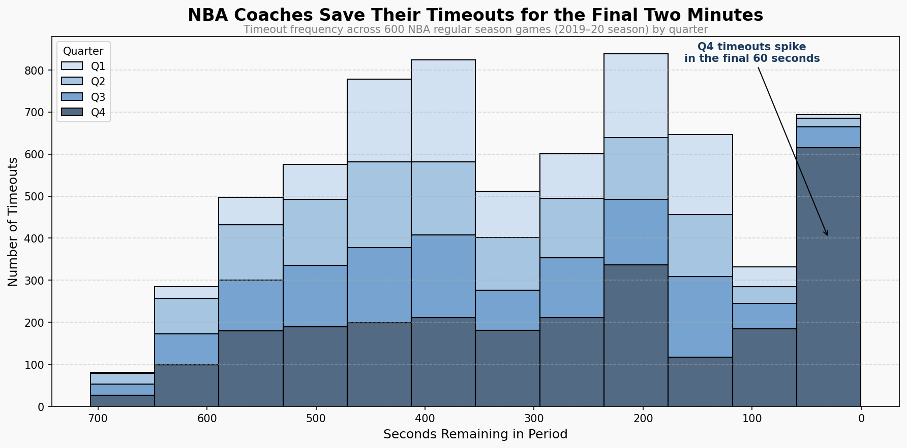
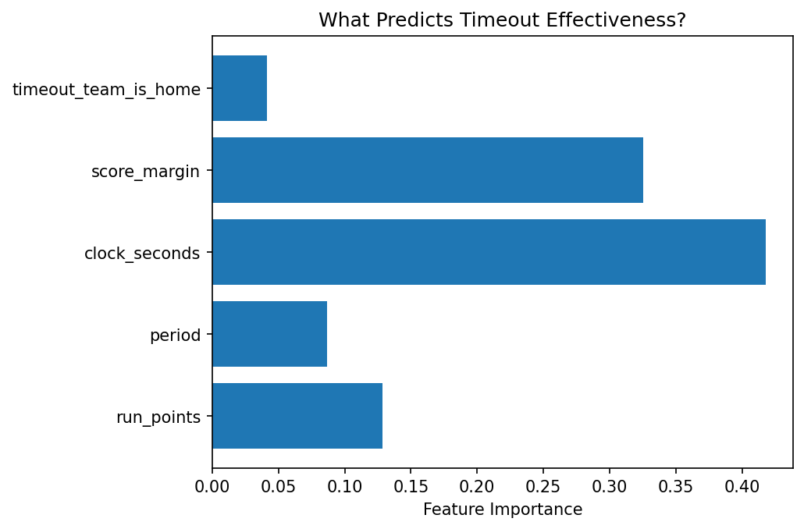
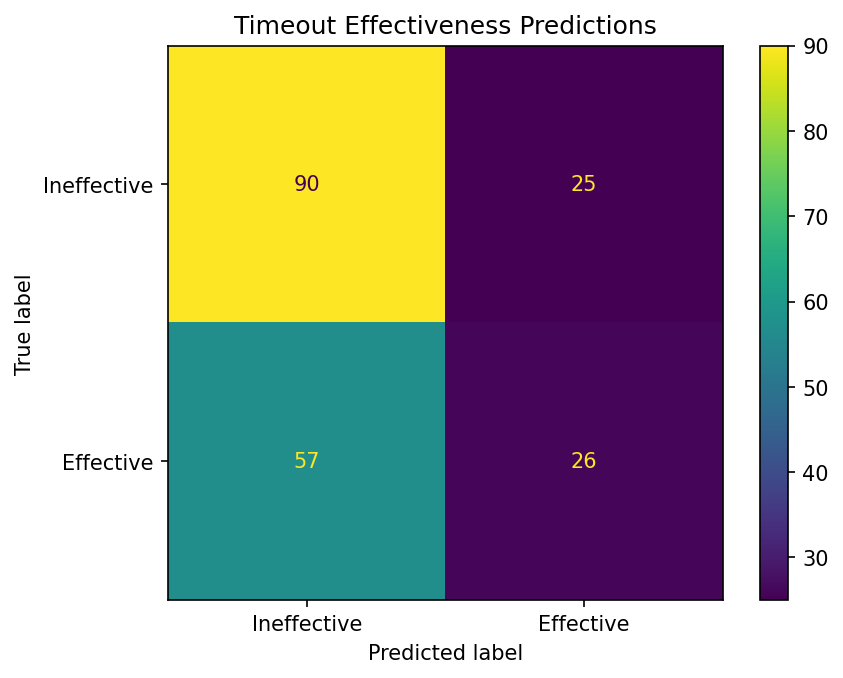
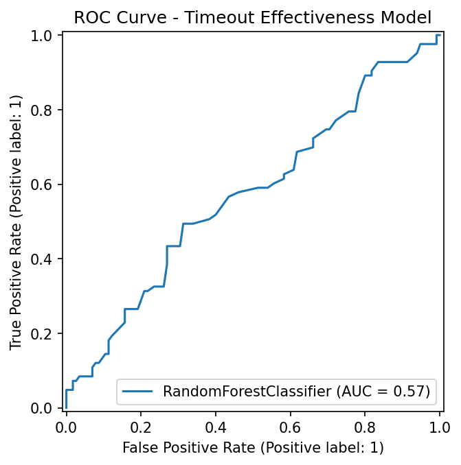

Do NBA Timeouts Actually Stop Scoring Runs? 
Statistical and machine learning analysis of timeout effectiveness during 8-0+ runs across 600+ NBA games.
Overview:
This project investigates whether NBA coaches' most common momentum-stopping strategy — calling a timeout during an opponent's scoring run — actually works. Using play-by-play data from 601 NBA regular season games, I built a full data pipeline, conducted statistical analysis, and trained a machine learning model to predict timeout effectiveness.
The findings:
Analyzing games from 2019-20 regular season, EDA revealed a surprising finding: teams that called a timeout during an opponent's 8-0+ run actually allowed more scoring afterward (5.26 pts) compared to runs where no timeout was called (4.28 pts) — a statistically significant difference (p=1.79e-11). A Random Forest classifier trained to predict timeout effectiveness confirmed this, achieving an AUC of 0.56, suggesting timeout effectiveness is largely unpredictable from game state alone.

## Visualizations

How it Works:
File Structure:
├── fetch_games.py # Pulls game IDs and team info from NBA API → SQLite 
├── fetch_pbp.py # Pulls play-by-play for each game → SQLite
├── detect_runs.py # Detects 8-0+ runs, identifies timeouts, engineers features 
├── model.py # Random Forest + Logistic Regression classifier 
├── nba.db # SQLite database (not tracked in git)
Game and play-by-play data are collected from the NBA Stats API and stored in a normalized SQLite database. A run detection algorithm identifies all 8-0+ scoring runs across every game, engineers contextual features (clock time, score margin, period, home/away), and stores results in a runs table. A Random Forest classifier is then trained to predict whether a timeout called during a run will be effective in slowing the run team's subsequent scoring.

Tech Stack:
- Python 
- SQLite / sqlite3 
- pandas
- scikit-learn 
- matplotlib / seaborn - scipy
- NBA Stats API (nba_api)

How to Run:
## Setup 
1. Clone the repository 
2. Create and activate a virtual environment: python -m venv nba_env source nba_env/bin/activate 
3. Install dependencies: pip install nba_api pandas matplotlib seaborn scipy scikit-learn 
4. Run in order: python fetch_games.py python fetch_pbp.py # Note: takes ~1 hour due to API rate limiting 
5. Run python detect_runs.py to create runs table.
6. Run python model.py

## Limitations & Future Work

**Limitations:**
- Analysis is based on 601 games from the 2019-20 season due to NBA Stats API rate limiting
- Measurement windows differ slightly between timeout and no-timeout groups — timeout runs are measured from the timeout event, no-timeout runs from when the run naturally ended
- Model accuracy (AUC 0.56) suggests important predictive features may be missing, such as team defensive ratings, player matchups, or fatigue

**Future Work:**
- Collect full 5 seasons of data (5,829 games) to validate findings at scale
- Engineer additional features — team defensive rating at time of run, player-level matchup data
- Explore whether specific coaches are more effective at using timeouts to stop runs
- Investigate home crowd noise effect more deeply — preliminary feature showed home/away status has minimal predictive power
